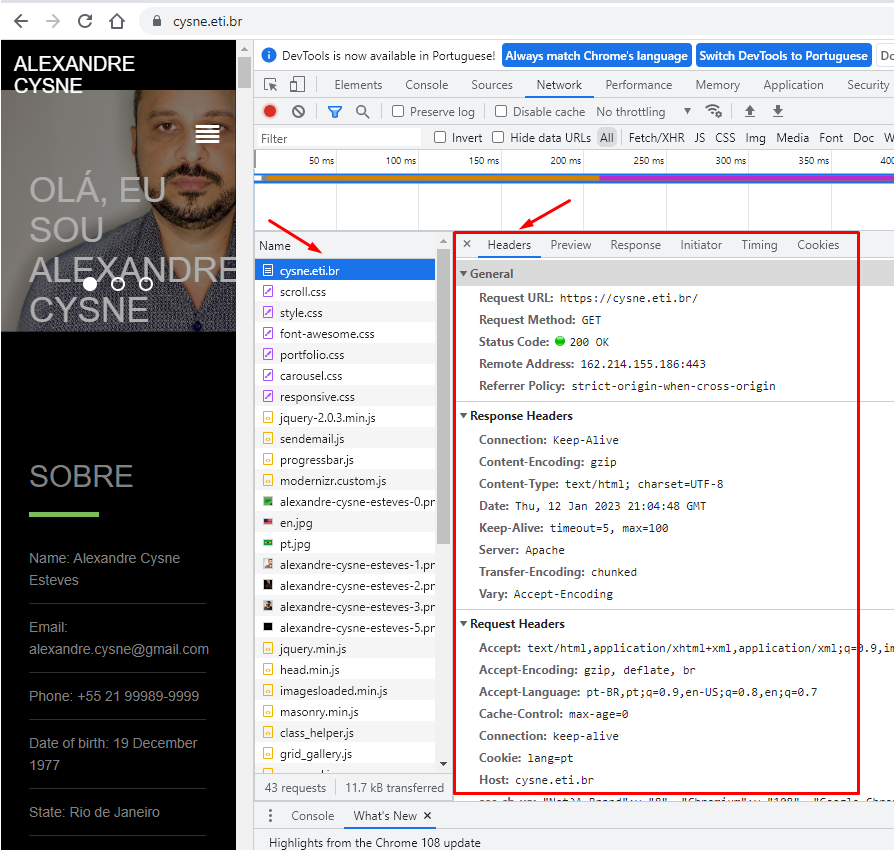

# URI, URL, e URN qual a diferença?

# O Protocolo HTTP

* O protocolo HTTP é um conjunto de regras de transmissão de dados que permitem que máquinas com diferentes configurações possam se comunicar com um mesmo "idioma". 
* Esse protocolo é baseado em requisição e resposta entre client e server. Quando o client (ou user agent) solicita um recurso na internet, ele envia um pacote de dados com cabeçalhos (Headers) a uma URI (Ou URL) e o destinatário (Provavelmente um Servidor) vai devolver uma resposta que pode ser um recurso ou outro cabeçalho.

## Para ver como tudo isso acontece faça o seguinte:

* Abra uma nova aba no seu navegador, no meu exemplo estou usando o Chrome e vou acessar o site cysne.eti.br, pressione F12 ou abra as Ferramentas de Desenvolvedor e clique em Network e acesse um site qualquer.

* Você vai reparar que serão baixados alguns arquivos, clique em qualquer um e clique em headers. 

**Vai aparecer algo igual a isso:**

* Você vai conseguir identificar o endereço remoto (162.214.155.186:443), a URL que foi requisitada, o método que foi utilizado (GET), o Status Code (200 - OK) e mais diversas outras informações, incluindo os cabeçalhos da resposta (Response Headers).

# URL – Uniform Resource Locator

* Em português: Localizador de Recursos Universal e como o próprio nome diz, se refere ao local, o Host que você quer acessar determinado recurso. O objetivo da URL é associar um endereço remoto com um nome de recurso na Internet.

* Exemplo de URL
1. cysne.eti.br
1. institutoiltonesteves.com.br
1. google.com.br

A URL é parte da URI.

# URN – Uniform Resource Name

* Em português: Nome de Recursos Universal, é o nome do recurso que será acessado e faz parte da URI.

* Exemplo de URN
1. home.html
1. index.php
1. contato.html

É comum associarmos URN a página que estamos acessando.

* Outro exemplos:
1. /api/v01/download
1. /pt-BR/download/

# URI – Uniform Resource Identifier

* Em português: Identificador de Recursos Universal, como diz o próprio nome, é o identificador do recurso. Pode ser uma imagem, uma página, etc, pois tudo o que está disponível na internet precisa de um identificador único para que não seja confundido.

* Exemplos de URI
1. https://cysne.eti.br/index.php
1. https://www.java.com/pt-BR/download/ie_manual.jsp?locale=pt_BR

## A URI une o Protocolo (https://), a localização do recurso URL (cysne.eti.br) e o nome do recurso URN (index.php) para que você acesse as páginas na Web.
